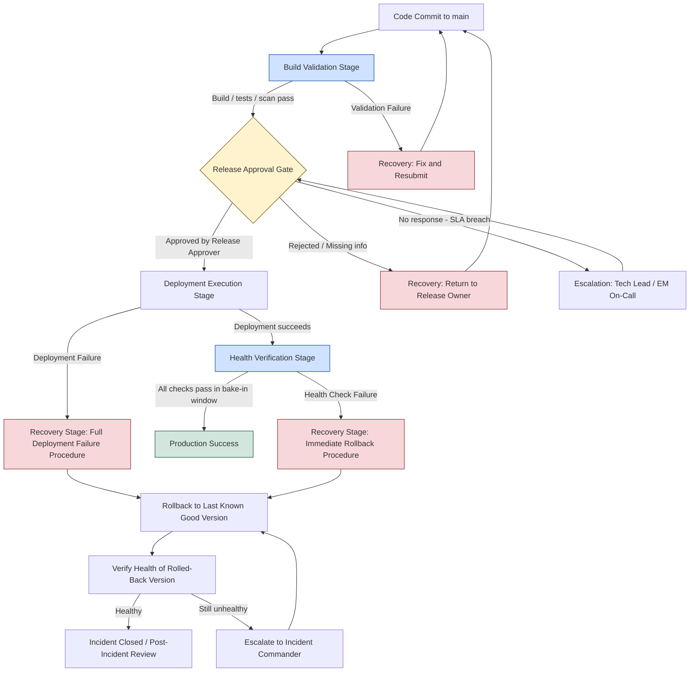

# Deployment Workflow Diagram — Checkout Service

This diagram represents the controlled release movement defined in
`DEPLOYMENT-WORKFLOW.md`, including approval points, validation checkpoints, and
recovery paths. It replaces the current unguarded flow
(`Code Commit → Deploy → Done`) shown in `.github/workflows/deploy.yml`.

## Mermaid Flowchart



## ASCII Equivalent (for non-rendering viewers)

```text
Code Commit
    |
    v
[Build Validation Stage] --(fail)--> Recovery: Fix & Resubmit --> back to Code Commit
    |
    | (pass)
    v
[Release Approval Gate] --(no response / SLA breach)--> Escalation (Tech Lead / EM) --back--> Approval Gate
    | \
    |  (rejected) --> Recovery: Return to Release Owner --> back to Code Commit
    | (approved)
    v
[Deployment Execution Stage] --(Deployment Failure)--> Recovery Stage: Full Deployment Failure Procedure --+
    |                                                                                                       |
    | (success)                                                                                             |
    v                                                                                                       |
[Health Verification Stage] --(Health Check Failure)--> Recovery Stage: Immediate Rollback Procedure --+    |
    |                                                                                                   |    |
    | (pass)                                                                                            v    v
    v                                                                                          [Rollback to Last Known Good Version]
[Production Success]                                                                                    |
                                                                                                          v
                                                                                          [Verify Health of Rolled-Back Version]
                                                                                             |                          |
                                                                                       (healthy)              (still unhealthy)
                                                                                             |                          |
                                                                                             v                          v
                                                                              [Incident Closed / Post-Incident Review]  Escalate to Incident Commander --> back to Rollback
```

## What the Diagram Shows

- **Release movement:** the primary path (blue/success boxes) runs strictly left to
  right through Build Validation → Approval → Deployment → Health Verification →
  Production Success. No stage can be skipped.
- **Approval points:** the single diamond (Release Approval Gate) is the only point
  where a human authorization decision is made, with an explicit escalation loop if the
  approver does not respond within SLA.
- **Validation checkpoints:** Build Validation and Health Verification (blue boxes) are
  automated checkpoints that can independently fail the release without human
  involvement, closing the "no validation gate" and "no health checks" gaps identified
  in `DEPLOYMENT-AUDIT.md`.
- **Recovery paths:** every failure branch (red boxes) routes into a defined recovery
  procedure from `ROLLBACK-PLAYBOOK.md` rather than dead-ending — a validation failure
  returns the release to the author, an approval rejection returns it to the owner, and
  a deployment or health failure always routes through rollback and re-verification
  before the incident is considered closed.
